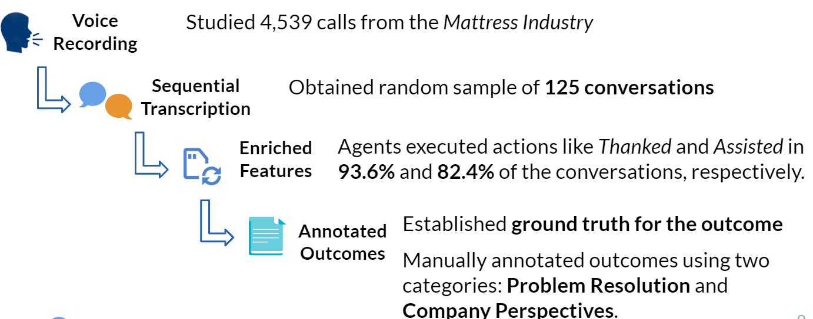
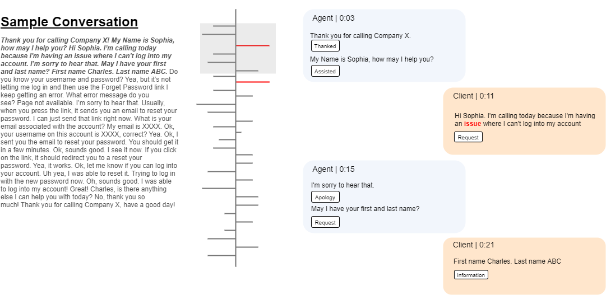
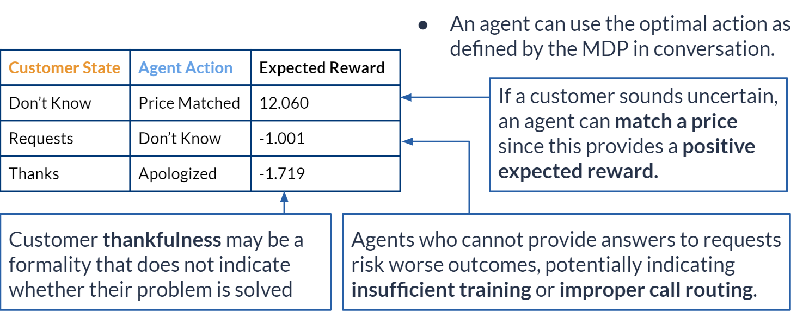

My team, which includes Charles Chen, Holt Crews, Kristi Kim, and Sophia Lam, published [this paper](../../assets/SIEDSPaper2019.pdf) in the April 2019 as part of our System Engineering Undergraduate Capstone project.

{: data-width="1867" data-height="1389"}
Data Collection and Methodology
{:.figure}

{: data-width="1867" data-height="1389"}
Sample processing of a transcribed conversation
{:.figure}

{: data-width="1867" data-height="1389"}
Optimal State Given Customer State
{:.figure}